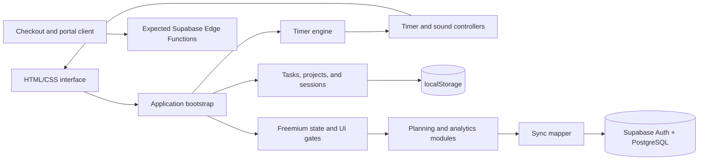

# Focus Pomodoro

A browser-based Pomodoro workspace that combines a configurable focus timer with local task tracking and an experimental Supabase-backed freemium architecture.

## Overview

Focus Pomodoro explores how a dependency-light productivity app can grow from a local-first timer into a tiered product without introducing a frontend framework. I built the timer engine, task and project state, browser persistence, sound synthesis, responsive interface, feature gates, analytics views, and the client-side boundaries for authentication, cloud sync, and billing.

The repository is currently an experimental integration snapshot. Its individual modules show the intended architecture, but the active module graph does not bootstrap successfully because `js/main.js` contains conflicting and incomplete integration code and references a missing `js/freemium.js` module. The Supabase payment functions invoked by the client are also not included.

## Features

- Configurable work, short-break, and long-break timers with start, pause, reset, and Space-bar control
- Tasks, projects, daily goals, completed-session history, and browser `localStorage` persistence
- Dark mode, Zen mode, responsive layouts, progress visualizations, and selectable synthesized sound cues
- Basic/Pro UI gating with upgrade, authentication, feedback, planning, analytics, archive, and sync interfaces
- Supabase schema and browser clients for email authentication, row-level user isolation, and data synchronization

## Interface and motion layer

The page that ships (`index.html`) boots `js/menace-app.js`: the Cat Desk Menace timer, where a focus session is framed as keeping a tiny cat from pushing something off a desk.

- **`js/menace-app.js`** — wiring only. One primary button that always states its next action (Start focus → Pause → Resume), one ghost button that reads "Reset" until abandoning would actually cost you something, and keyboard shortcuts (`Space`, `R`, `C`, `S`, `Esc`).
- **`js/ambience.js`** — time-of-day palettes (`dawn`/`day`/`dusk`/`night`, automatic from the clock or forced from the topbar), plus the drifting dust, stars, and night fireflies. Session progress is published as a `--progress` CSS variable, so the sun in the window climbs and the sunbeam tilts as the session runs.
- **`js/desk-stage.js`** — keeps the cat idling: random blinks, eyes that follow the pointer, a tail that quickens while the timer runs, and a visible "tense" tell over the last 18% of a session.
- **`js/fx.js`** — self-cleaning particles: confetti, floating emoji, coins that arc into the wallet, click rings, and number roll-ups. Every effect no-ops under `prefers-reduced-motion`.
- **`js/easter-eggs.js`** — six discoverable secrets, listed as locked slots in the Stats view so hunting them is a collection rather than a rumour. They are cosmetic only and never touch the timer or your stats.

## Technical Highlights

- **Separated timer domain logic.** `PomodoroTimer` owns countdown state and exposes tick, mode-change, and completion subscriptions. DOM updates and sound behavior sit in controller modules, keeping timekeeping independent from presentation.
- **Local-first state model.** Projects, tasks, sessions, goals, ideas, preferences, and tier state are stored behind shared storage helpers. A completed work interval is associated with the active project and task before analytics are recalculated.
- **Progressive Pro loading.** The intended entry point initializes the basic timer and task experience first, then dynamically imports analytics and planning behavior when the freemium state changes to Pro.
- **Explicit sync translation.** The sync layer maps camelCase browser objects to the Supabase schema, scopes reads by authenticated user, upserts each collection, and merges local and remote records using update timestamps.
- **Database authorization.** `supabase/schema.sql` enables Row Level Security and defines per-user CRUD policies for profiles, projects, tasks, sessions, goals, and ideas. An auth trigger creates a profile for each new user.
- **Browser-native audio.** Sound cues are generated through the Web Audio API instead of bundled audio files, with independent persisted toggles for tick, milestone, and completion sounds.
- **Static deployment hardening.** `netlify.toml` publishes the repository root and defines frame, MIME-sniffing, referrer, permissions, XSS, and cache headers.

There is no automated test suite in the repository. Validation is currently limited to source inspection and manual browser testing.

## Architecture



`index.html` loads Supabase configuration and authentication as classic scripts, then loads `js/app.js` as the ES-module entry point. `app.js` composes the timer, controllers, local state, freemium manager, optional Pro modules, and sync manager. Supabase is an enhancement boundary: local state is the browser-side source used by the timer and task UI, while authenticated Pro state is intended to synchronize through the schema in `supabase/schema.sql`.

The diagram describes the implemented module boundaries, including the external Edge Function boundary expected by `js/payments.js`; those server functions are not present in this repository.

## Tech Stack

- Semantic HTML5 and CSS3
- Vanilla JavaScript with ES modules
- Browser APIs: `localStorage`, Web Audio, Notifications, and SVG
- Supabase JavaScript v2, Auth, PostgreSQL, Row Level Security, and Edge Function client calls
- Google Analytics and an embedded Google Forms feedback form
- Netlify static-hosting configuration
- Mermaid for this architecture diagram only

## Getting Started

No dependency installation or build step is defined. A local HTTP server is required for the ES-module imports.

```bash
python -m http.server 8000
```

Then open `http://localhost:8000/`.

The command was verified with Python 3.14. Before expecting a working UI, resolve the current entry-point issues in `js/main.js`: it imports both a missing `./freemium.js` and the existing `./freemium/index.js` under the same binding, and its Pro bootstrap construction is incomplete. Supabase-dependent behavior also requires a reachable project provisioned with `supabase/schema.sql`. Checkout and billing portal actions additionally require deployed `create-checkout` and `billing-portal` Edge Functions, which are not included here.

## Demo

Screenshot coming soon.

The repository contains deployment metadata for `focus-pomadoro.com`, but it does not provide evidence that the site is currently deployed, so no live-demo claim is made here.

## Project Status

**Experimental.** The core timer, local state, UI modules, Supabase schema, authentication client, sync mapping, and feature-gating code are present. The immediate planned work is to repair the browser entry-point integration, add automated coverage for timer and state behavior, implement and test the missing payment Edge Functions, and verify the full authentication/sync/payment flow end to end.

## What I Learned

- A timer becomes easier to extend when countdown state emits events instead of directly controlling the page; sound, analytics, notifications, and persistence can subscribe independently.
- A local-first model needs an explicit translation layer once database naming, nullable relationships, ownership, and conflict resolution enter the design.
- Frontend feature gates improve product presentation but do not provide authorization; subscription state and database RLS must enforce access at trusted boundaries.
- Splitting a growing application into modules is only useful when the composition root remains coherent. The current broken entry path is a concrete reminder to validate the integrated browser graph, not just isolated files.
